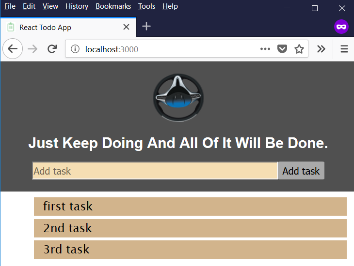

# The project in 1 picture

## ToDos
    [+] Add task
    [+] Style task list
    [+] Change task status to `Done`
    [+] Change task status to `ToDo`
    [+] Delete task
    [+] Edit task
    [+] Why not call `this.props.toggleTaskItemStatus` directly (instead of `this.changeTaskItemStatus`) in the  `onChange` property of `TaskItem` component??? [Refactoring Exercise]
    [ ] Auto-sort list based on task status - Push completed items below incomplete ones. 
    [+] Animations

## Tools and Libraries
- This project was bootstrapped with [Create React App](https://github.com/facebookincubator/create-react-app).
- [Yarn](https://yarnpkg.com/en/) instead of [npm](https://www.npmjs.com/)
- [momentjs](http://momentjs.com/) for easy date formating
- [react-flip-move](https://github.com/joshwcomeau/react-flip-move) for simple adding/removing todo item animations

## Common Tasks
- `yarn start` to start server.
- `yarn build` to build for production dedployment
- `yarn test` to run test suite
- `yarn add libraryName` instead of `npm install libraryName --save` to install `libraryName` locally and configure your `package.json` accordinngly.

## References
- [Book - Learn React by Kirupa Chinnathambi](https://amzn.to/2ISaSvD) - This book is a definitive read for React Beginners.
- [React Docs - Uncontrolled Components](https://reactjs.org/docs/uncontrolled-components.html)
- [Checkboxes in React.js](http://react.tips/checkboxes-in-react/)
- [Github Issue Tracker - Regression: onChange doesn't fire with defaultChecked and radio inputs](https://github.com/facebook/react/issues/9988)
- [Github Issue Tracker - Can't update 'checked' attribute](https://github.com/facebook/react/issues/6321)
- [Reddit - Sharing Constants in ES6](https://www.reddit.com/r/javascript/comments/3bo42p/sharing_constants_in_es6_modules/)

## Uncontrolled Components vs. Controlled Components
* Form elements contain some state on their own. For example: 
    - your text element might have some content in it, 
    - you may have some items already selected in a drop-down, and so on. 
* React is all about centralizing all state into its own little world, so it doesn't like that form elements have their own internal mechanism for storing state. 
* The guidance is to synchronize all of the form data inside a React component by using events like `onChange`. These components that let React deal with form elements are known as **Controlled Components**.
* While that is the guidance, it is a hassle to have every form element deal with keeping state in sync. The React developers get that as well. 
    - The workaround is to do nothing.
    - We simply let form elements deal with their own state and use `refs` to access the values when needed. That is what we did in this example.
* When we have components that defer all state management to the form DOM element, these components are known as **Uncontrolled Components**.