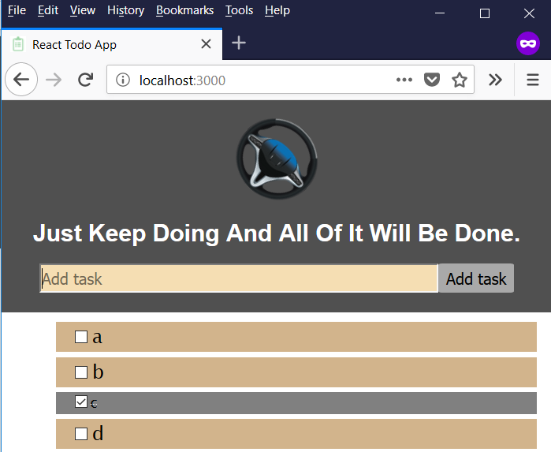

# The project in 1 picture

## Tools and Libraries
- This project was bootstrapped with [Create React App](https://github.com/facebookincubator/create-react-app).
- [Yarn](https://yarnpkg.com/en/) instead of [npm](https://www.npmjs.com/)
- [momentjs](http://momentjs.com/) for easy date formating

## Common Tasks
- `yarn start` to start server.
- `yarn build` to build for production dedployment
- `yarn test` to run test suite
- `yarn add libraryName` instead of `npm install libraryName --save` to install `libraryName` locally and configure your `package.json` accordinngly.
